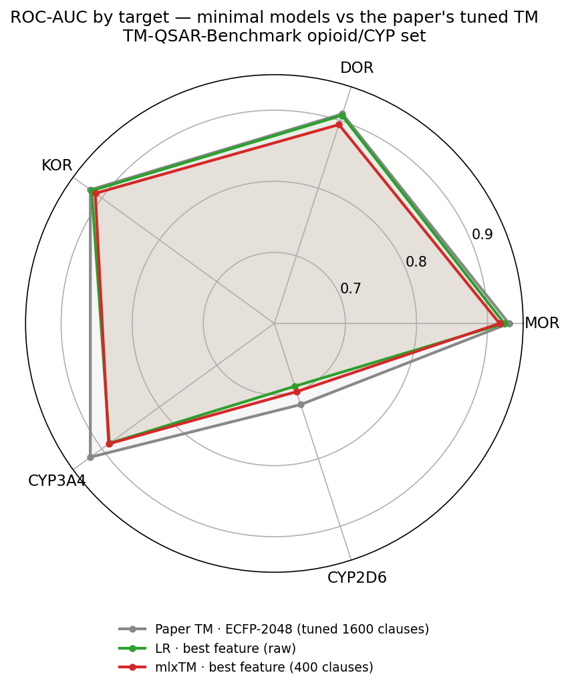

# Rules, not weights: running Tsetlin Machines on your Mac's GPU — and feeding them molecules the smart way

Most of ML right now is "throw a big differentiable model at it." This post is about the
opposite instinct: a model that learns **plain if-then rules you can read**, why we got it
running fast on Apple Silicon, and — the fun part — how the way you *feed* it turns out to
matter far more than the model itself.

Everything's open source and `pip`-installable (macOS only): **[mlxTM](https://github.com/guillaume-osmo/mlxTM)**.

---

## The 2-minute Tsetlin Machine

Imagine a **jury of tiny detectives**. Each one knows one simple rule — *"if fragment A is
present AND fragment B is absent, I vote 'active'."* A **Tsetlin Machine (TM)** is exactly that:
a pile of these AND-rules ("clauses"), each casting a weighted vote. The class with the most
votes wins.

Three things an ML person should file away:

- **It only speaks in switches.** Every input must be a 0/1 bit. (Hold that thought — it's the
  whole second half of this post.)
- **Inference is basically a tiny binary neural net** — two matrix multiplies and a threshold.
  GPUs love it.
- **It's interpretable for free.** A trained TM *is* a readable rule set — closer to RuleFit
  than to a black box.

Each "should I use this feature in this rule?" decision is made by a little **learning automaton**
— picture a thermostat that nudges toward *include* or *exclude* as it sees more examples. No
gradients, no backprop. Just rules earning their place.

## Why it wouldn't run on a Mac (and how we fixed it)

The good Tsetlin libraries ([cair/tmu](https://github.com/cair/tmu),
[PyTsetlinMachineCUDA](https://github.com/cair/PyTsetlinMachineCUDA)) **only speak CUDA** — they
won't even compile on Apple Silicon. So we rewrote the whole thing in Apple's
[MLX](https://github.com/ml-explore/mlx) / Metal, from scratch.

`mlxTM` ships five flavors — a dense one, a bit-packed one (32 switches per machine word), a
weighted "coalesced" one, a **fully bit-packed trainer** (we taught a Metal kernel to *count in
binary with carries* — the GPU trick that makes training fast), and a scikit-learn-style wrapper.

```python
from mlx_tm import DenseTsetlinMachine
tm = DenseTsetlinMachine(n_clauses=20, T=15, s=3.9).fit(X_bits, y, epochs=30)
tm.predict(X_test)
```

How'd it do? It nails the classic **Noisy-XOR** sanity test (100%), and runs **~14× faster to
train, ~46× faster to predict** than a CPU baseline — all on the laptop's GPU. The bit-packed
trick gives another 6–13×. (We checked it bit-for-bit against a plain NumPy reference, so this
isn't hand-waving.)

## The real game: a rule-learner only eats switches

Here's the catch nobody warns you about. The TM is great, but it needs **bits**. Molecules come
as continuous descriptors or sparse fingerprints. So the actual problem becomes:

> **How do you turn a molecule into the *right* switches?**

Two sub-questions: **how** do you switch-ify a number, and **which** features do you keep? We
benchmarked both, honestly, under proper cross-validation (no hyperparameter-tuning magic).

### Switch-ifying a number (binarization)

The simplest trick is a **thermometer**: picture a rising volume bar. A value of 0.7 lights up the
"> 0.2", "> 0.4", "> 0.6" notches but not "> 0.8". How many notches? **4–5 is plenty; 8 is a waste**
(the data literally got *slightly worse* at 8). Good rule of thumb to keep.

We also tried fancier encoders — and stole one straight from the **LLM-quantization** playbook.
Methods like [QuaRot](https://arxiv.org/abs/2404.00456) and QuIP get LLMs down to 2–4 bits by
**rotating** the data first — spin the space so the outliers flatten out, *then* snap to bits.
(Think: rotating a messy room so everything lines up before you photograph it in low resolution.)
It's a fantastic **compression** lever (same accuracy at half the bits) — but, honestly, **not an
accuracy lever**. Thermometer-at-4-bits is a strong, boring default.

### Picking features without peeking (RPCholesky)

When you have thousands of features, you select. We use **RPCholesky** — think of it as assembling
a **diverse committee** that doesn't keep repeating itself. The key property: **it never looks at
the labels.** No peeking at the answers means no leakage, and you can compute the selection *once*
and reuse it for every task. (ML translation: a label-free, Nyström-style diverse-subset picker.)

## molFTP: features that already think like a rule-learner

This is where it gets nice. A normal fingerprint (ECFP) asks a yes/no question: *"is fragment X
present?"* [molFTP](https://github.com/osmoai/molftp) asks a richer one: *"how strongly does
fragment X lean toward active vs inactive?"* — a little **significance score** per fragment.

Notice that's **exactly what the TM is already voting on.** molFTP scores fragments by
significance; the TM builds rules out of significant fragments and votes. They're the same idea at
two levels — so molFTP is a *natural* front-end for a TM, not a bolt-on. (Getting molFTP's C++ to
load on a Mac was its own yak-shave — re-signing the library and redirecting it to the right
graphics/RDKit dylibs — but it runs.)

And it's efficient: molFTP's compact **27-number** summary already rivals a 2048-bit ECFP
fingerprint.

### The 20,000-fragment problem (and the oldest trick in the book)

Go past the summary and molFTP hands you the *full* signal: **28,000–66,000** fragment scores. Way
too many switches for the rule-learner. So how do you shrink it?

- **RPCholesky? No.** It's a net for a dense lake; these are sparse needles, and the informative
  fragments are *rare* — exactly what it throws away. It didn't just underperform, it **collapsed**
  (one target dropped to near-coin-flip).
- **The hashing trick? Yes.** This is just **ECFP folding** in disguise: stuff 66k fragments into
  ~8k buckets and let collisions wash out. **No measurable signal lost**, and it *beats* plain ECFP.

That gives a clean, memorable rule:

> **Net for dense lakes, magnet for sparse needles** — RPCholesky for continuous descriptors,
> hashing/significance for sparse fragment keys. Use the wrong one and you *lose*.

## A second front-end: bond-centered fingerprints, Sort&Slice, and OOV

The baseline everyone reaches for is a **folded** 2048-bit ECFP. But folding glues unrelated
fragments onto the same switch (hash collisions) — and a collided, ambiguous switch is *noise* to a
rule-learner. [bcfp](https://github.com/osmoai/bcfp) offers two fixes the TM cares about:

- **BCFP** — the same Morgan idea, but **bond-centered** (*"is this bond-environment present?"*)
  instead of atom-centered. A complementary view; concatenating ECFP+BCFP is the paper's
  combined representation.
- **Sort&Slice + OOV** — instead of folding, **keep the top-K most frequent training fragments as
  their own clean switches**, and add a single **out-of-vocabulary** bucket that catches test-set
  fragments never seen in training. It's a label-free, frequency-ranked selection (a cousin of the
  RPCholesky idea, but for sparse bits) with a built-in distribution-shift safety net.

Why a TM should *prefer* this: a folded fingerprint hands the rule-learner thousands of collided,
ambiguous literals; Sort&Slice hands it a few hundred clean, meaningful ones. Fewer, better switches
→ tighter rules. (We found a small RDKit-2026 bug in bcfp's presence path while wiring this up, and
fixed it upstream — see the bcfp repo.)

## "Wait — is it cheating?"

molFTP uses the labels to score fragments, so the natural worry is leakage. The clean way to
settle it (every ML person knows this one): **shuffle the labels and rerun the whole pipeline.**
If the model still "works," it was cheating. Ours dropped to **0.48 AUC — pure coin-flip.** Honest.
(We fit molFTP *per fold* on training labels only; the held-out fold never sees its own answers.)

## So what do you actually get?

A **molFTP → Tsetlin Machine** pipeline that:

- **matches ECFP** on the molecular benchmarks (sometimes beats it),
- is **tiny and interpretable** — every rule reads like *"has significant-active fragment A AND not
  significant-inactive fragment B → active,"*
- is **leakage-proven**, and
- runs **on your Mac's GPU.**

And the honest meta-lesson: on these tasks, **simple baselines are hard to beat**. The fancy
machinery (rotation binarization, RPCholesky, huge descriptor sets) pays off in **speed,
interpretability, leakage-safety, and Apple-GPU support** — not in a magic accuracy jump. That's a
more useful truth than another "SOTA" claim.

## 📊 Show me the numbers

We kept the prose light, so here are the receipts — cross-validated **ROC-AUC** on two
opioid-target datasets (MDR1, MOR) from the **TM-QSAR-Benchmark**
([code](https://github.com/PaulC61/TM-QSAR-Benchmark),
[paper](https://pubs.acs.org/doi/10.1021/acs.jcim.5c03109)) — the study that first benchmarked
Tsetlin Machines against Random Forest and XGBoost for molecular property prediction. We reuse its
datasets (and its ECFP-2048 → TM as the baseline to beat), then ask a different question: with the
TM running on Apple's GPU, how far does *feature engineering* move the needle?

**How we turned molecules into bits** (quick logistic-regression probe, identical splits):

| representation → bits | MDR1 | MOR |
|---|---|---|
| ECFP-2048 (presence) | 0.974 | 0.933 |
| ECFP-2048 **count** → thermometer ×3 | 0.976 | 0.933 |
| RDKit2D-217 → RPCholesky-128 → thermometer | 0.973 | 0.887 |
| Osmordred-3585 → RPCholesky-1024 → thermometer | **0.980** | 0.913 |
| curated molFTP 27-d aggregate → thermometer | 0.956 | 0.918 |
| curated molFTP per-key → **feature-hash 8192** ×2-bit | 0.971 | **0.940** |
| curated molFTP per-key → RPCholesky-1024 ×2-bit | 0.953 | 0.827 |

*Read it as:* feature-hashing the 28k–66k molFTP keys into 8,192 buckets keeps the signal and
**beats ECFP on MOR** (0.940 vs 0.933); RPCholesky on those sparse keys throws signal away (0.827).
Net for lakes, magnet for needles. *(We dropped the unhashed "full 28k–66k" representation — tens of
thousands of features for ~1,500 molecules is an overfit trap, not an honest baseline.)*

**On the actual Tsetlin Machine** — extending the
[TM-QSAR-Benchmark](https://pubs.acs.org/doi/10.1021/acs.jcim.5c03109)'s **ECFP-2048 → TM** baseline
to **curated [molFTP](https://github.com/osmoai/molftp)** and **[bcfp](https://github.com/osmoai/bcfp)**
(ECFP/BCFP Sort&Slice + OOV), across **all five of the paper's opioid/CYP targets** (plus MDR1). One
self-consistent run — every row through the *same* Coalesced TM (400 clauses / 20 epochs, 3-fold CV,
presence-binarized unless noted). **Bold = best of ours per target:**

| features → mlxTM (400-clause) | MDR1 | MOR | DOR | KOR | CYP3A4 | CYP2D6 |
|---|---|---|---|---|---|---|
| ECFP-2048 (presence) — *paper's descriptor* | 0.965 | 0.901 | 0.883 | 0.901 | **0.888** | 0.664 |
| ECFP-2048 count → thermo ×3 | **0.978** | 0.889 | 0.869 | 0.892 | 0.868 | 0.623 |
| curated molFTP 27-d → thermo ×4 | 0.962 | **0.917** | **0.894** | **0.911** | 0.855 | 0.700 |
| bcfp ECFP Sort&Slice + OOV | 0.964 | 0.907 | 0.888 | 0.892 | 0.859 | 0.684 |
| bcfp BCFP Sort&Slice + OOV | 0.969 | 0.887 | 0.872 | 0.884 | 0.868 | 0.671 |
| bcfp ECFP+BCFP Sort&Slice + OOV | 0.972 | 0.909 | 0.890 | 0.902 | 0.862 | **0.701** |
| *paper TM — ECFP, tuned 1600-clause* | — | 0.93 | 0.91 | 0.92 | 0.92 | 0.72 |

**The LR variant** — the same six representations through a plain **logistic regression** on the *raw*
vectors (no binarization; the simple-baseline role RF/XGBoost play in the paper). **Bold = best of
ours per target:**

| features → Logistic Regression | MDR1 | MOR | DOR | KOR | CYP3A4 | CYP2D6 |
|---|---|---|---|---|---|---|
| ECFP-2048 (presence) | **0.976** | **0.923** | **0.908** | **0.918** | **0.887** | 0.675 |
| ECFP-2048 count | 0.975 | 0.920 | 0.900 | 0.915 | 0.880 | 0.679 |
| curated molFTP 27-d | 0.961 | 0.912 | 0.893 | 0.904 | 0.841 | 0.624 |
| bcfp ECFP Sort&Slice + OOV | 0.973 | 0.917 | 0.890 | 0.906 | 0.885 | 0.677 |
| bcfp BCFP Sort&Slice + OOV | 0.971 | 0.904 | 0.868 | 0.894 | 0.877 | 0.687 |
| bcfp ECFP+BCFP Sort&Slice + OOV | 0.975 | 0.918 | 0.889 | 0.912 | 0.882 | **0.693** |
| *paper TM — ECFP, tuned 1600-clause* | — | 0.93 | 0.91 | 0.92 | 0.92 | 0.72 |



*Read it three ways:*

- **Best feature is model-dependent.** The **TM** likes **molFTP-27** (significance-scored, rule-friendly
  — it wins all three opioids); **LR** likes **plain ECFP** (best on 5 of 6). Count-ECFP only helps MDR1,
  and BCFP needs its ECFP partner. No free lunch across model × target.
- **LR is the surprise.** A trivial logistic regression on raw ECFP **nearly matches the paper's
  Optuna-tuned 1600-clause TM** on the opioids — MOR 0.923 vs 0.93, DOR 0.908 vs 0.91, KOR 0.918 vs
  0.92 — and edges out our minimal 400-clause TM. On these targets, **a simple linear model is hard to
  beat.**
- **vs. the paper (the gray ring).** Both our *minimal* models trail the tuned TM by ~0.01–0.03 — a
  *model-strength* gap (more clauses + HP search), not a feature gap; LR closes nearly all of it for
  free. The TM's real edge here isn't a SOTA bump — it's **interpretable if-then rules running on
  Apple's GPU.** (Permutation test: no leakage.)

## A cheat-sheet for the ML crowd

| we said | you already know it as |
|---|---|
| Tsetlin clause | a learned if-then rule (RuleFit-ish) |
| binarization | quantization, but to 1-bit switches |
| rotation binarizer | QuaRot / QuIP incoherence; ITQ / SimHash |
| RPCholesky select | label-free Nyström / diverse-subset selection |
| molFTP scores | per-fragment target encoding (leakage-safe) |
| the hashing trick | the feature-hashing / ECFP-folding trick |
| the leakage check | a permutation test |

## References & further reading

- **TM-QSAR-Benchmark** — the study this post builds on: it benchmarked Tsetlin Machines against
  Random Forest and XGBoost for QSAR, and supplied the MDR1/MOR opioid datasets and the
  ECFP-2048 → TM baseline we extend.
  [code](https://github.com/PaulC61/TM-QSAR-Benchmark) ·
  [paper, *J. Chem. Inf. Model.* 2025](https://pubs.acs.org/doi/10.1021/acs.jcim.5c03109)
- **molFTP** — fragment-target prevalence features.
  [code](https://github.com/osmoai/molftp) · [paper, arXiv:2510.06029](https://arxiv.org/abs/2510.06029)
- **bcfp** — bond-centered fingerprints (ECFP/BCFP) with Sort&Slice + OOV.
  [code](https://github.com/osmoai/bcfp) · [paper, arXiv:2510.04837](https://arxiv.org/abs/2510.04837)
- **mlxTM** — this library: Tsetlin Machines on Apple's GPU. [code](https://github.com/guillaume-osmo/mlxTM)
- **MLX** — Apple's array framework. [code](https://github.com/ml-explore/mlx)
- Binarization lineage: [QuaRot](https://arxiv.org/abs/2404.00456) / QuIP (rotation), ITQ / SimHash;
  RPCholesky (Chen, Epperly & Tropp, 2022 — label-free Nyström selection).

## Try it

```bash
git clone https://github.com/guillaume-osmo/mlxTM && cd mlxTM
pip install -e .            # macOS / Apple Silicon only (MLX has no Linux/Windows wheels)
python examples/noisy_xor.py
```

Five GPU backends, the feature utilities (binarizers, RPCholesky), 27 passing tests, MIT-licensed.
Kick the tires, and tell me where it breaks.
